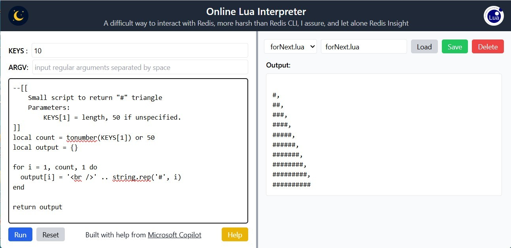

### Online Lua Interpreter
A web-based Lua script editor and executor using Node.js, Redis, and TailwindCSS.


#### Prologue


#### I, Features
- Write and run Lua scripts
- Pass KEYS and ARGV parameters
- View output in real-time
- Save, load, and delete scripts


#### II. Setup
```
git clone https://github.com/Albert0i/online-lua-interpreter
cd online-lua-interpreter
npm install
```

`.env`
```
HOST=localhost
PORT=3000

REDIS_HOST=localhost
REDIS_PORT=6379
REDIS_USERNAME=default
REDIS_PASSWORD=123456
```

```
npm run dev 
```



#### III. Bibliography 
1. [online demo](https://lua-interpreter.onrender.com/)
2. [Lua Online Compiler & Interpreter](https://onecompiler.com/lua)


#### Epilogue 


### EOF (2025/08/15)
