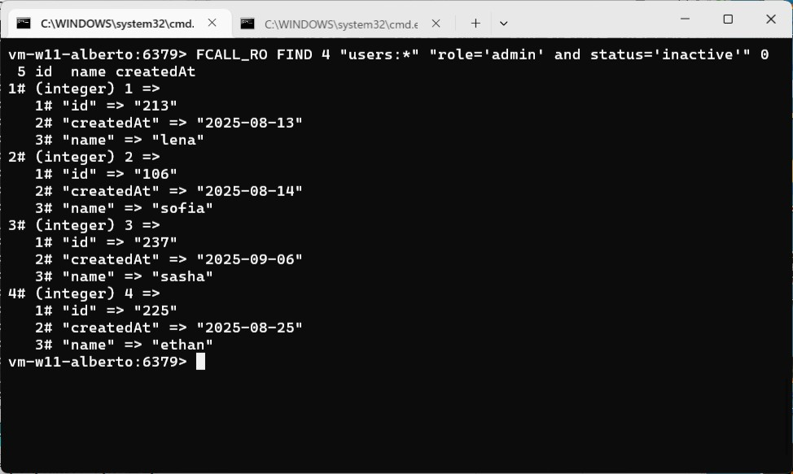

### The importance of being able to...
> "only chance decides where we stop, that’s to say, opinion is a matter of chance."<br />The Castle by Franz Kafka


#### Prologue 
        ███████╗  ██╗  ███╗░░██╗  ██████╗░
        ██╔════╝  ██║  ████╗░██║  ██╔══██╗
        █████╗░░  ██║  ██╔██╗██║  ██║░░██║
        ██╔══╝░░  ██║  ██║╚████║  ██║░░██║
        ██║░░░░░  ██║  ██║░╚███║  ██████╔╝
        ╚═╝░░░░░  ╚═╝  ╚═╝░░╚══╝  ╚═════╝░


#### I. [SQL](https://en.wikipedia.org/wiki/SQL) 
[SQL Statement](https://dev.mysql.com/doc/refman/8.4/en/sql-statements.html), the unparalleled capability provided by [Relational database](https://en.wikipedia.org/wiki/Relational_database), is indispensable tool in modern software development.  General speaking, it is divided into: 
- **DDL – Data Definition Language**
Used to define and modify database structures: `CREATE`, `ALTER`, `DROP`, `TRUNCATE`, `RENAME`
- **DML – Data Manipulation Language**
Used to manipulate data within tables: `INSERT`, `UPDATE`, `DELETE`, `MERGE`

You can *practically* perform search on arbitrary criteria, no matter the fields are indexed or not. This gives developer greatest flexibility in:
- **Data inspection**: search on unforeseen condition; 
- **Integrity checking**: cross reference other table with [SQL JOIN](https://www.w3schools.com/sql/sql_ref_join.asp); 
- **Data correction**: fix and patch broken data; 
- **Data aggregation**: making statistic reports. 

All can be done in SQL statement interactively, the role of primary database remains unshakeable in the future, I perceive. 


#### II. [NoSQL](https://en.wikipedia.org/wiki/NoSQL) 
The idea was brought forward by **Rise of Web 2.0 and Big Data** after year of millennium. It is another species and paradigm of database featuring flexibility and scalability. Instead of splitting and organizing data into *tabular* format, NoSQL database advocates *data to be used together should be stored together*.  In this way, reading and writing data can be done in one go, no need to do JOIN, the point is *no need to read/write extra tables*. It trades space for speed in some extend, so to speak. 

More often than not, NoSQL needs no schema, some of them *do* offer optional schema to begin with. The the heavy lifting of maintaining schema consistency is completely removed and thus all responsibility of data consistency are left to the developers. 

If you are using NoSQL as primary database, oftentimes you need to locate a record like so: "Which user has role='admin' and status='inactive'" for example. *Day by day, drudgery soon grinds you down into ashes*, believe me. Some NoSQL database offers search capability like Redis, but the convenience is not on the same level of SQL database. 

In Redis, I use Hash to store data extensively, use Sorted Set for index purpose. I need to look up field value of Hashes and I don't have [Redis Query Engine](https://redis.io/docs/latest/develop/ai/search-and-query/)... so can I make it by *brute force*, much like a doing a full table scan in RDBMS?!

`find.lua`
```
--[[
    Return Redis hashes matching a pattern and a simple condition, 
    Parameters:
        KEYS[1] - Key pattern to scan for, "users:*";
        KEYS[2] - Expression to evaluate for, "role='admin' and status='inactive'";
        KEYS[3] - Number of documents to skip, 0 if unspecified; 
        KEYS[4] - Maximum number of documents to return, 10 if unspecified; 
        ARGV[]  - Fields to return, "id name status" for example, 
                  Return all fields if unspecified.
]]
local keyPrefix = KEYS[1] or "*"
local expr1 = KEYS[2] or "1"
local rpn = infix_to_rpn(expr1)
local offset = tonumber(KEYS[3]) or 0
local limit = tonumber(KEYS[4]) or 10

local cursor = "0"  -- the cursor.
local matched = {}  -- result to be returned 
local index = 1     -- index to place retrieved value
  
repeat
    redis.setresp(2) -- RESP2 
    local scan = redis.call("SCAN", cursor, "MATCH", keyPrefix, "COUNT", 100, 'TYPE', 'HASH')
    -- "scan" returns [ cursor, keys ]
    cursor = scan[1]
    local keys = scan[2]

    for _, key in ipairs(keys) do
        -- Get all values to evaluate 
        redis.setresp(3) -- RESP3
        local row = redis.call("HGETALL", key)
        -- If found and evaluate to true
        if (row) and (evaluate_rpn(row, rpn)) then 
            -- Skip offset 
            if offset > 0 then 
                offset = offset - 1
            else 
                -- Take limit 
                if limit > 0 then 
                    -- If no field names specified to return 
                    if (ARGV[1] or "*") == "*" then
                        table.insert(matched, row) 
                    else
                        --table.insert(matched, redis.call("HMGET", key, unpack(ARGV))) 
                        local slimrow = {}
                        for _, v in ipairs(ARGV) do
                            slimrow[v] = row['map'][v]
                        end
                        table.insert(matched, { map=slimrow}) 
                    end

                    -- Increase the index 
                    index = index + 1
                    -- Decrease the limit
                    limit = limit - 1
                else 
                    -- Readhed limit before scan completed
                    return { map=matched }
                end 
            end         
        end
    end 
until (cursor == "0") -- Loop until no more keys found

-- Scan completed
return { map=matched }
```

> Redis Insight does not support RESP3 at the moment, but we are working on it.

```
redis-cli

HELLO 3
FCALL_RO FIND 2 "users:*" "role='admin' and status='inactive'"
FCALL_RO FIND 4 "users:*" "role='admin' and status='inactive'" 0 3
FCALL_RO FIND 4 "users:*" "role='admin' and status='inactive'" 0 5 id  name createdAt
```





#### Epilogue 
> "A few good-natured people laughed, while others preserved an awkward silence, the latter were in the majority, and no one seemed inclined to answer K.’s question."<br />The Castle by Franz Kafka


### EOF (2025/08/22)