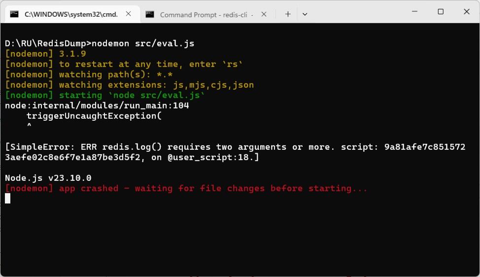

###  A Primer on [Scripting with Lua](https://redis.io/docs/latest/develop/programmability/eval-intro/)
> "never let yourself be so far deceived as to doubt that."<br />The Castle by Franz Kafka


#### Prologue
I was much eager to obtain a good quick start guide on programming in [Lua](https://en.wikipedia.org/wiki/Lua) in Redis and it turned out I have to create my own... 

Lua is full of memories not because I love moon, it is an artefact with pecular language constructs which are stigmata from epoch elapsed. 


#### I. Brief History
> Lua (/[ˈluːə](https://en.wikipedia.org/wiki/Help:IPA/English)/ [LOO-ə](https://en.wikipedia.org/wiki/Help:Pronunciation_respelling_key); from [Portuguese](https://en.wikipedia.org/wiki/Portuguese_language): [lua](https://en.wiktionary.org/wiki/lua#Portuguese) [[ˈlu(w)ɐ](https://en.wikipedia.org/wiki/Help:IPA/Portuguese)] meaning [moon](https://en.wikipedia.org/wiki/Moon)) is a [lightweight](https://en.wikipedia.org/wiki/Lightweight_programming_language), [high-level](https://en.wikipedia.org/wiki/High-level_programming_language), [multi-paradigm](https://en.wikipedia.org/wiki/Multi-paradigm_programming_language) [programming language](https://en.wikipedia.org/wiki/Programming_language) designed mainly for [embedded use](https://en.wikipedia.org/wiki/Scripting_language) in applications.[[3](https://en.wikipedia.org/wiki/Lua#cite_note-luaspe-3)]

> Lua [syntax](https://en.wikipedia.org/wiki/Syntax_(programming_languages)) for control structures was mostly borrowed from [Modula](https://en.wikipedia.org/wiki/Modula) (`if`, `while`, `repeat/until`), but also had taken influence from [CLU](https://en.wikipedia.org/wiki/CLU_(programming_language)) (multiple assignments and multiple returns from function calls, as a simpler alternative to [reference parameters](https://en.wikipedia.org/wiki/Call_by_reference) or explicit [pointers](https://en.wikipedia.org/wiki/Pointer_(computer_programming))), [C++](https://en.wikipedia.org/wiki/C%2B%2B) ("neat idea of allowing a [local variable](https://en.wikipedia.org/wiki/Local_variable) to be declared only where we need it"[[6](https://en.wikipedia.org/wiki/Lua#cite_note-hopl2007-6)]), [SNOBOL](https://en.wikipedia.org/wiki/SNOBOL) and [AWK](https://en.wikipedia.org/wiki/AWK) ([associative arrays](https://en.wikipedia.org/wiki/Associative_array)). 

> In an article published in [Dr. Dobb's Journal](https://en.wikipedia.org/wiki/Dr._Dobb%27s_Journal), Lua's creators also state that LISP and Scheme with their single, ubiquitous data-structure mechanism (the [list](https://en.wikipedia.org/wiki/List_(abstract_data_type))) were a major influence on their decision to develop the table as the primary data structure of Lua.[[8](https://en.wikipedia.org/wiki/Lua#cite_note-ddj96-8)]

> Lua [semantics](https://en.wikipedia.org/wiki/Semantics) have been increasingly influenced by Scheme over time,[[6](https://en.wikipedia.org/wiki/Lua#cite_note-hopl2007-6)] especially with the introduction of [anonymous functions](https://en.wikipedia.org/wiki/Anonymous_function) and full [lexical scoping](https://en.wikipedia.org/wiki/Scope_(computer_science)#Lexical_scope_vs._dynamic_scope). Several features were added in new Lua versions.

> Lua lets you run part of your application logic inside Redis. Such scripts can perform conditional updates across multiple keys, possibly combining several different data types atomically.

> Scripts are executed in Redis by an embedded execution engine. Presently, Redis supports a single scripting engine, the [Lua 5.1](https://www.lua.org/) interpreter. Please refer to the [Redis Lua API Reference](https://redis.io/docs/latest/develop/programmability/lua-api/) page for complete documentation. 


#### I. Content


##### 1. Comments 
In Lua, comment has two styles: 
```
-- This is a SQL-like single line comment. 

--[[
    This comment spans more than one lines. 
    The syntax is bizarre, pretty much a 
    -- follows by a multi-line string. 
]]
```

##### 2. Variables
In Lua, variable definition not precedes with **local** is conceived to be  global scope and by convention global variable should starts with capital letter, although you are not restricted to do so. 
Under Redis, all variable definition *MUST* be local scope., you just can't use: 
```
Variable = "value"
```

Which incurs a: 
```
Error: ERR Error running script: @globals:9: Script attempted to create global variable 'Variable' stack traceback:  [G]: in function 'error'  @globals:9: in function <@globals:5>  @user_script:1: in main chunk  [G]: ?
```

You have to use: 
```
local variable = "value"
```

##### 3. Use `end` to mark end of scope
```
for i = 1, 5 do

end

while x < 10 do

  x = x + 1
end

repeat

  x = x + 1
until x > 10

function greet(name)
  print("Hello, " .. name)
end

do
  local temp = 42
  print(temp)
end

if x > 0 then
  print("Positive")
elseif x < 0 then
  print("Negative")
else
  print("Zero")
end
```

With the exception of `repeat until`:
```
repeat

  x = x + 1
until x > 10
```

##### 4. Use `goto` to quit endless loop
```
::start::
while true do
  local x = math.random()

  if x > 0.9 then
    goto done
  end
end

::done::
```

##### 5. Interacting with Redis from a script
> It is possible to call Redis commands from a Lua script either via [redis.call()](https://redis.io/docs/latest/develop/programmability/lua-api/#redis.call) or [redis.pcall()](https://redis.io/docs/latest/develop/programmability/lua-api/#redis.pcall).

> The two are nearly identical. Both execute a Redis command along with its provided arguments, if these represent a well-formed command. However, the difference between the two functions lies in the manner in which runtime errors (such as syntax errors, for example) are handled. Errors raised from calling redis.call() function are returned directly to the client that had executed it. Conversely, errors encountered when calling the redis.pcall() function are returned to the script's execution context instead for possible handling.

> For example, consider the following:
```
> EVAL "return redis.call('SET', KEYS[1], ARGV[1])" 1 foo bar
OK
```

> The above script accepts one key name and one value as its input arguments. When executed, the script calls the [SET](https://redis.io/docs/latest/commands/set/) command to set the input key, foo, with the string value "bar".

##### 6. Parallel assignment
Function returns multiple values.
```
local function myfunc() 
	return 100, 'lua', { "a", "table" } 
end 

local score, name, output = myfunc() 
```

Swapping without introducing temporary variable.
```
local a, b = 100, 200

a, b = b, a
```

##### 7. `..` and `...`
`..` is string concatenate operator in Lua, this is akin to `||` in SQL statement.
```
local name = 'Lua'
local message = 'Hi ' ..name.. ' nice to neet you.'
```
`...` on the other hand is for unknow number of arguments in function definition. 
```
local function sum(...) 
	local args = {...}
	local total = 0 

    for i=1, #args do
        total = total + args[i]
    end 
    return total 
end 

local n = sum(1, 2, 3, 4, 5)
```

##### 8. ["Strange Case of Lua Table"](https://www.gutenberg.org/files/43/43-h/43-h.htm)

The *one and only one* data structure in Lua is table, which has two favours: 
- **Array style table** 
```
    local table1 = { "iong_dev", "active" }
```

Or *explicitly* specify the index: 
```    
    local table1 = { [1] = "iong_dev", [2] = "active" }
```

- **Dictionary style table** 
```
    local table2 = { name = "iong_dev", status = "active" }
```

The difference is subtle and intricacy elusive... 

The [unpack](https://www.luadocs.com/docs/functions/table/unpack) function returns the elements of a table as separate values, allowing you to easily use them in a function call or assign them to multiple variables.

**Syntax**
```
unpack(tableData, start, end)
```

- `tableData` - The table containing the elements to be unpacked.
- `start` - The index of the first element to unpack. Defaults to 1.
- `end` - The index of the last element to unpack. If omitted, unpacks all elements from start to the end of the table.

**Return**

The function returns the elements of the table as separate values. If the specified indices are out of range, it returns nil.

**Description**

The `unpack()` function is particularly useful for passing table elements as arguments to functions that expect multiple parameters. It allows you to work with table data in a more flexible way.

This function looks for numeric index starting from 1, which doesn't exist in dictionary style table. A call to 
```
    redis.log(redis.LOG_NOTICE, unpack(table1))
```

Will output: 'iong_dev active' in `redis.log`. Whereas a call to
```
    redis.log(redis.LOG_NOTICE, unpack(table2))
```

Results in an error. 
```
node:internal/modules/run_main:104
    triggerUncaughtException(
    ^

[SimpleError: ERR redis.log() requires two arguments or more. script: 9a81afe7c8515723aefe02c8e6f7e1a87be3d5f2, on @user_script:18.]
```



This is because `unpack(table2)` returns `nil` which triggers the error.  Similarly, array style table has length; dictionary style table *HAS NOT*... Therefore, 
```
    return { #table1, #table2 }
```

Returns `[ 2, 0 ]` to the client. To set `myhash` with
```
    local table3 = { 'name', 'iong_dev', 'status', 'active', 'age', 59 }

    redis.call('HSET', 'myhash', unpack(table3))
```

Which effectively do a
```
    HSET myhash name iong_dev status active age 59
```

To encode with `cjson.encode` so that will see better
```
    redis.log(redis.LOG_NOTICE, cjson.encode(table1))
```
Will output: '["iong_dev","active"]' in `redis.log`

```    
    redis.log(redis.LOG_NOTICE, cjson.encode(table2))
```
Will output: '{"name":"iong_dev","status":"active"}' in `redis.log`

Last but not least, to return a dictionary style table using RESP3, instead of using
```
    redis.setresp(3)
    return { name = "iong_dev", status = "active" }
```

Which always gives `[]`, an empty array! You *should* use
```
    redis.setresp(3)
    return { map={ name = "iong_dev", status = "active" } }
```

Which gives
```
[Object: null prototype] { name: 'iong_dev', status: 'active' }
```

A *real* javascript objct! Be sure to precede the script call with
```
await redis.sendCommand(['HELLO', '3'])
```

As a bonus, what is the expected behaviour of this code? 
```
    local table4 = { name = "iong_dev", status = "active", 
                     [1]="berto_dev", [2]="inactive" } 

    redis.log(redis.LOG_NOTICE, unpack(table4))
    redis.log(redis.LOG_NOTICE, #table4)
```

- [Mastering Lua Unpack Table: A Quick Guide](https://luascripts.com/lua-unpack-table)

##### 9. Output
You can use `redis.log` to output message to `redis.log`. 
```
redis.log(redis.LOG_WARNING, 'Something is terribly wrong')
```

Will produce a line similar to the following in your server's log:
```
[32343] 22 Mar 15:21:39 # Something is terribly wrong
```

##### 10. Return
The standard way to reply 'Ok': 
```
redis.status_reply('Ok')
```

The standard way to reply an error: 
```
redis.error_reply('ERR My very special table error')
```

> **Note**: By convention, Redis uses the first word of an error string as a unique error code for specific errors or ERR for general-purpose errors. Scripts are advised to follow this convention, as shown in the example above, but this is not mandatory.


#### III. Retrospection
I am going to discuss two unique language features in Lua which are not present in modern programming languages.

##### 1. Parallel [assignment](https://www.lua.org/manual/5.1/manual.html#2.5:~:text=2.4.3%20%E2%80%93-,Assignment,-Lua%20allows%20multiple)
> Lua allows multiple assignments. Therefore, the syntax for assignment defines a list of variables on the left side and a list of expressions on the right side. The elements in both lists are separated by commas:
```
  stat ::= varlist `=´ explist
	varlist ::= var {`,´ var}
	explist ::= exp {`,´ exp}
```

> Before the assignment, the list of values is *adjusted* to the length of the list of variables. If there are more values than needed, the excess values are thrown away. If there are fewer values than needed, the list is extended with as many nil's as needed. If the list of expressions ends with a function call, then all values returned by that call enter the list of values, before the adjustment (except when the call is enclosed in parentheses; see [§2.5](https://www.lua.org/manual/5.1/manual.html#2.5)).

> The assignment statement first evaluates all its expressions and only then are the assignments performed. Thus the code
```
     i = 3
     i, a[i] = i+1, 20
```     

> sets a[3] to 20, without affecting a[4] because the i in a[i] is evaluated (to 3) before it is assigned 4. Similarly, the line
```
     x, y = y, x
```     

> exchanges the values of x and y, and
```
     x, y, z = y, z, x
```     

> cyclically permutes the values of x, y, and z.

The documentation does not mention the *order* of execution of each pairs of assignment, 
```
local a, b, c = func1(), func2(), func3() 
```

The answer is *non-deterministic*. It is unsafe to assume any sort of order in the other words, correctness of result should *not* depend on any order of exection. 


##### 2. [Coroutines](https://www.lua.org/manual/5.1/manual.html#2.5:~:text=2.11%20%E2%80%93-,Coroutines,-Lua%20supports%20coroutines) 
> Lua supports coroutines, also called **collaborative multithreading**. A coroutine in Lua represents an independent thread of execution. Unlike threads in multithread systems, however, a coroutine only suspends its execution by explicitly calling a yield function.

> You create a coroutine with a call to [coroutine.create](https://www.lua.org/manual/5.1/manual.html#pdf-coroutine.create). Its sole argument is a function that is the main function of the coroutine. The `create` function only creates a new coroutine and returns a handle to it (an object of type **thread**); it does not start the coroutine execution.

> When you first call [coroutine.resume](https://www.lua.org/manual/5.1/manual.html#pdf-coroutine.resume), passing as its first argument a thread returned by [coroutine.create](https://www.lua.org/manual/5.1/manual.html#pdf-coroutine.create), the coroutine starts its execution, at the first line of its main function. Extra arguments passed to [coroutine.resume](https://www.lua.org/manual/5.1/manual.html#pdf-coroutine.resume) are passed on to the coroutine main function. After the coroutine starts running, it runs until it terminates or **yields**.

> A coroutine can terminate its execution in two ways: normally, when its main function returns (explicitly or implicitly, after the last instruction); and abnormally, if there is an unprotected error. In the first case, [coroutine.resume](https://www.lua.org/manual/5.1/manual.html#pdf-coroutine.resume) returns **true**, plus any values returned by the coroutine main function. In case of errors, [coroutine.resume](https://www.lua.org/manual/5.1/manual.html#pdf-coroutine.resume) returns **false** plus an error message.

> A coroutine yields by calling [coroutine.yield](https://www.lua.org/manual/5.1/manual.html#pdf-coroutine.yield). When a coroutine yields, the corresponding [coroutine.resume](https://www.lua.org/manual/5.1/manual.html#pdf-coroutine.resume) returns immediately, even if the yield happens inside nested function calls (that is, not in the main function, but in a function directly or indirectly called by the main function). In the case of a yield, coroutine.resume also returns **true**, plus any values passed to [coroutine.yield](https://www.lua.org/manual/5.1/manual.html#pdf-coroutine.yield). The next time you resume the same coroutine, it continues its execution from the point where it yielded, with the call to [coroutine.yield](https://www.lua.org/manual/5.1/manual.html#pdf-coroutine.yield) returning any extra arguments passed to [coroutine.resume](https://www.lua.org/manual/5.1/manual.html#pdf-coroutine.resume).

> Like [coroutine.create](https://www.lua.org/manual/5.1/manual.html#pdf-coroutine.create), the [coroutine.wrap](https://www.lua.org/manual/5.1/manual.html#pdf-coroutine.wrap) function also creates a coroutine, but instead of returning the coroutine itself, it returns a function that, when called, resumes the coroutine. Any arguments passed to this function go as extra arguments to [coroutine.resume](https://www.lua.org/manual/5.1/manual.html#pdf-coroutine.resume). [coroutine.wrap](https://www.lua.org/manual/5.1/manual.html#pdf-coroutine.wrap) returns all the values returned by [coroutine.resume](https://www.lua.org/manual/5.1/manual.html#pdf-coroutine.resume), except the first one (the boolean error code). Unlike [coroutine.resume](https://www.lua.org/manual/5.1/manual.html#pdf-coroutine.resume), [coroutine.wrap](https://www.lua.org/manual/5.1/manual.html#pdf-coroutine.wrap) does not catch errors; any error is propagated to the caller.

`coroutine.lua`
```
local ret, msg, output = true, '', {} 

local function taskA(x)
  table.insert(output, ' x = ' .. x)
  local y = coroutine.yield(x)
  table.insert(output, ' y = ' .. y)
  local z = coroutine.yield(y)
  table.insert(output, ' z = ' .. z)

  return z
end

local function print(r, m) 
	table.insert(output, ' ret = '.. tostring(r))
	table.insert(output, ' msg = '.. tostring(m))
end 

local co = coroutine.create(taskA)
ret, msg = coroutine.resume(co, "fossil")
print(ret, msg)
ret, msg = coroutine.resume(co, "stigmata")
print(ret, msg)
ret, msg = coroutine.resume(co, "delirium")
print(ret, msg)
ret, msg = coroutine.resume(co, "ecstasy")
print(ret, msg)

return output
```

Output: 
```
 x = fossil, 
 ret = true, msg = fossil, y = stigmata, 
 ret = true, msg = stigmata, z = delirium, 
 ret = true, msg = delirium, 
 ret = false, msg = can not resume a dead thread
```

The use of `coroutine.resume` and `coroutine.yield` to pass in and out values is elusive, unintelligible and beyond imagination at first sight. While the above example is trivial, let's look at another example. 

`prodcons.lua`
```
local ret, msg, joblist, output = true, '', 'prodcons:joblist', {} 
local timestamp = unpack(redis.call('TIME'))
math.randomseed(tonumber(timestamp))

local function producer() 
	while true do
		local n = math.random(1, 10)
		for j=1, n do 
			redis.call('LPUSH', joblist, math.random(1, 9999))
		end 
		coroutine.yield(n)
	end 
end 
local function consumer() 
	while true do
		local n = math.random(1, 15)
		for j=1, n do 
			local val = redis.call('RPOP', joblist)
			if (val == false) then 
				coroutine.yield((j-1)..'/'..n)
				n = 0
				break
			end
		end 
		if n~=0 then 
			coroutine.yield(n)
		end
	end 
end 
local function print(m) 
	table.insert(output, m)
end 

local coprod = coroutine.create(producer)
local cocons = coroutine.create(consumer)

print('initial len = '..redis.call('LLEN', joblist))
for i=1, 10 do 
	ret, msg = coroutine.resume(coprod) 
	print(' ret ='..tostring(ret)..', produced = '..msg)
	print(' len = '..redis.call('LLEN', joblist))
	ret, msg = coroutine.resume(cocons) 
	print(' ret ='..tostring(ret)..', consumed = '..msg)
    print(' len = '..redis.call('LLEN', joblist))
end

return output
```

[Producer-Consumer problem](https://en.wikipedia.org/wiki/Producer%E2%80%93consumer_problem) is canonical programming example of cooperation. A fast producer incurs backlog; a fast consumer incurs starvation. In our example, we use a random `n` to control number of jobs to process, ie. producer pushes `n` number of 1~9999 into list and yield whereas consumer pulls `n` numbers out and yield. I deliberately let consumer runs faster than producer, consumer has two yield path, ie. either `n` is reached or list is empty. 

Output:
```
initial len = 3, 
ret =true, produced = 4, len = 7, 
ret =true, consumed = 7/11, len = 0, 
ret =true, produced = 1, len = 1, 
ret =true, consumed = 1, len = 0, 
ret =true, produced = 6, len = 6, 
ret =true, consumed = 6/14, len = 0, 
ret =true, produced = 9, len = 9, 
ret =true, consumed = 9/11, len = 0, 
ret =true, produced = 10, len = 10, 
ret =true, consumed = 6, len = 4, 
ret =true, produced = 4, len = 8, 
ret =true, consumed = 8/13, len = 0, 
ret =true, produced = 8, len = 8, 
ret =true, consumed = 5, len = 3, 
ret =true, produced = 5, len = 8, 
ret =true, consumed = 5, len = 3, 
ret =true, produced = 8, len = 11, 
ret =true, consumed = 3, len = 8, 
ret =true, produced = 9, len = 17, 
ret =true, consumed = 15, len = 2
```

Coroutine was once an important concept where computer was expensive and multitasking operating system was not popular. 


#### IV. Bibliography 
1. [Programming in Lua (first edition)](https://www.lua.org/pil/contents.html)
2. [Lua 5.1 Reference Manual](https://www.lua.org/manual/5.1/)
3. [Lua Primer](https://fennel-lang.org/lua-primer)
4. [Lua Online Compiler & Interpreter](https://onecompiler.com/lua)
5. [The Castle by Franz Kafka](https://files.libcom.org/files/Franz%20Kafka-The%20Castle%20(Oxford%20World's%20Classics)%20(2009).pdf)


#### Epilogue 
Lua bears pecular traits of languages which are not derived from [C](https://en.wikipedia.org/wiki/C_(programming_language)) family. Typically, one-based array, parallel assignment and [coroutine](https://www.lua.org/manual/5.4/manual.html#2.6:~:text=2.6%20%E2%80%93-,Coroutines,-Lua%20supports%20coroutines) (協同子程序) are hardly seen on modern programming languages. 

Lua borrows syntax from Modula which was descendant of the [Pascal](https://en.wikipedia.org/wiki/Pascal_(programming_language)) language. The `begin/do`and `end` syntax to define a block are characteristic infrequently seen. 

Table, the only composite data structure, borrows from [Lisp](https://en.wikipedia.org/wiki/Lisp_(programming_language)) and provides unparalleled flexibility to handle structured data. 


### EOF(2025/08/22)
